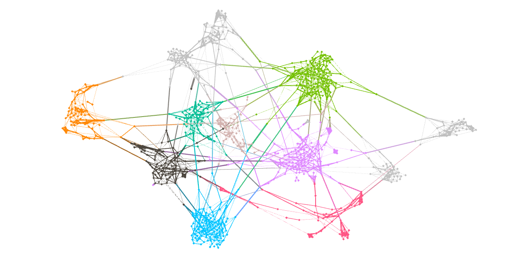
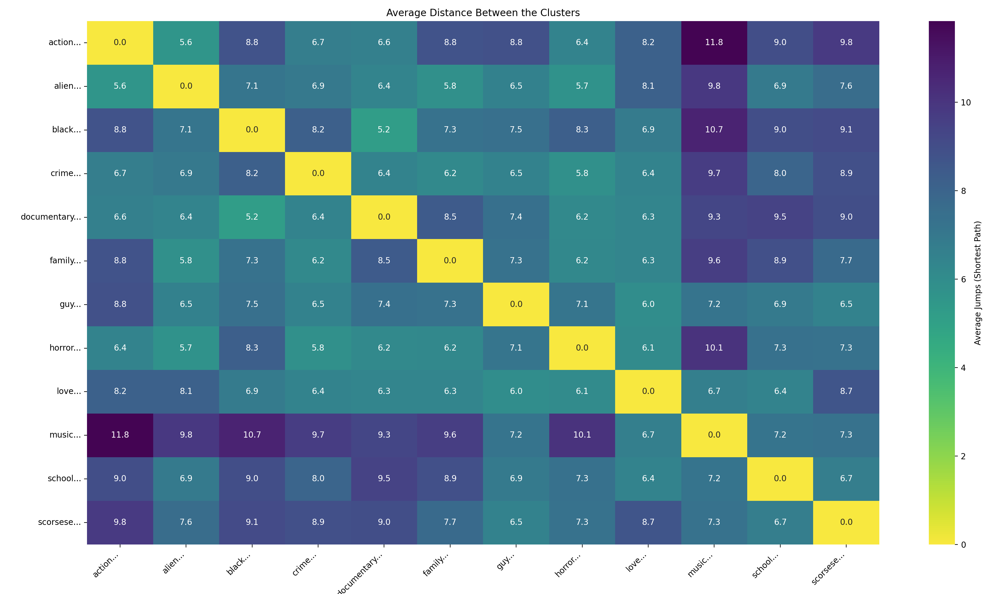

# 🎬 Projet Web Mining : Analyse des Critiques de Cinéma

**Cours :** MLSMM2153 - Web Mining (2025-2026)  
**Professeurs :** Corentin Vande Kerckhove & Sylvain Courtain  
**Sujet 4 :** Analyse des critiques culturelles sur des blogs (Cinéma)

---

## 👥 L'Équipe

* **Arthur Ottevaere**
* **Mohamed Amine El Mohcine**
* **Lenny Andry**

---

## 📖 Contexte et Objectifs

Ce projet a pour but d'analyser les critiques cinématographiques se trouvant sur des blogs en ligne. Dans ce projet, nous collectons et analysons un total de 900 critiques provenant d'un des blogs cinématographiques anglophones de référence : `https://www.rogerebert.com`. L'objectif est d'y déceler des tendances sémantiques et structurelles.

Le projet suit une démarche classique de web mining, à savoir :

1. **Collecte de données (Scraping) :** Récupération automatique de corpus massifs (textes, notes, métadonnées, casting).
2. **Text Mining :** Prétraitement linguistique (NLP/Lemmatisation), vectorisation (TF-IDF), analyse lexicographique et sémantique, et identification de thématiques latentes (Clustering K-Means).
3. **Link Analysis :** Modélisation d'un graphe sémantique non orienté, analyse de la topologie réseau (détection d'îlots, Small World) et identification des œuvres influentes via des mesures de centralité et de prestige (PageRank, Information Centrality).

---

## 📂 Structure du Projet

L'architecture respecte la séparation entre code source, données brutes et résultats dans le but de faciliter la réplication des analyses.

```text
.
├── main.py                 # Fonction de lancement du projet (pipeline)
├── src/                    # Code source Python
│   ├── scraping            # Scripts de collecte des données (RogerEbert)
│   ├── text_mining         # Scripts de transformation et d'analyse du contenu textuel des critiques
│   ├── link_analysis       # Scripts de construction du graphe et d'analyse des liens
│
├── data/
│   ├── raw/                # Données brutes issues du scraping, text-mining et link-analysis (.csv/.xlsx)
│   │                       # Note : Ces fichiers ne sont pas versionnés sur GitHub (via .gitignore)
│   └── processed/          # Données nettoyées prêtes pour l'analyse
│
├── results/                # Graphiques et visualisations
├── .gitignore              # Configuration des fichiers exclus (env, données lourdes)
├── requirements.txt        # Liste des dépendances Python nécessaires
└── README.md               # Documentation du projet
```

---

## 🚀 Guide d'Utilisation (Pipeline)

### 1. Installation

Assurez-vous d'avoir Python 3.9+ installé. Clonez le repo et installez les dépendances (`requirements.txt`) :

```Bash
git clone https://github.com/ArthurOttevaere/WebMining-Cinema-Reviews.git
cd WebMining-Cinema-Reviews
pip install -r requirements.txt
```

### 2. Exécution des analyses

L'ensemble du pipeline (Scraping, Text mining et Link analysis) est orchestré par un script unique (`main.py`) afin d'assurer une meilleure réplicabilité. Alors, pour lancer l'analyse complète du projet, il suffit d'entrer la commande suivante dans votre terminal :

```Bash
python main.py
```

Ce script exécute, en arrière-plan, les étapes suivantes :

* **Chargement des données :** Par défaut, le script charge le dataset fourni `data/processed/reviews_final_900.csv` pour éviter une nouvelle collecte longue des données. Cela permet également d'obtenir les mêmes résultats que ceux illustrés dans le rapport et dans l'ensemble de l'analyse.

* **Text mining :** Nettoyage, vectorisation TF-IDF et clustering des critiques cinématographiques. Des visuels relatifs à l'analyse descriptive et sémantique apparaitront au lancement du code.

* **Construction du graphe :** Génère des noeuds et des arêtes sur base de la similarité cosinus. Ces "Nodes" et "Edges" sont directement calculées via le corpus de données scrapé (`data/processed/reviews_final_900.csv`).

* **Link analysis :** Analyse structurelle via calcul matriciel. Le script génère les métriques de centralité et de prestige clés (*PageRank*, *Information Centrality*, *Closeness*, *Betweenness*), analyse la topologie globale (Diamètre, Rayon) et visualise les distances moyennes entre les thèmes via une *Heatmap*.

### **⚠️ Note importante concernant le Scraping (`RUN_SCRAPER = False`)**

Par défaut, la collecte de nouvelles données est désactivée pour garantir la **stricte réplicabilité des résultats** présentés dans notre rapport.

Bien que le module de scraping soit complet et fonctionnel (importé via `src.scraping`), nous vous recommandons vivement de **ne pas passer cette variable à `True`**, car :

1. **Cohérence :** Le site *RogerEbert.com* étant dynamique, une nouvelle collecte modifierait le corpus. Les clusters et métriques de graphe divergeraient alors de ceux analysés dans le PDF rendu.

2. **Performance :** L'analyse s'exécute ici instantanément sur le jeu de données figé (`data/processed/reviews_final_900.csv`), alors qu'un nouveau scraping prendrait un temps plus conséquent.

Le code de scraping est inclus dans le projet à des fins de démonstration méthodologique et de vérification technique uniquement.

---

## 🧠 Méthodologie et Concepts Clés

### Scraping

La constitution du corpus repose sur une stratégie de navigation *Breadth-First Search (BFS)* ciblée sur le site `https://www.rogerebert.com`.

* **Approche :** Utilisation d'un système de file d'attente (Queue) initialisé par des critiques récentes (Seeds). Le script ne collecte pas au hasard mais suit les citations entre critiques pour garantir une cohérence sémantique. Une contrainte de profondeur (depth < 2) limite l'exploration aux voisins immédiats et secondaires, garantissant un corpus centré sur les citations directes sans divergence exponentielle.

* **Outils :** `BeautifulSoup` pour le parsing HTML et extraction structurée (Titre, Score, Métadonnées, Texte).

* **Volume :** Corpus final de 900 critiques structurées.

### Text Mining

Le pipeline de traitement du langage naturel vise à transformer le texte brut en indicateurs quantitatifs et sémantiques.

* **Prétraitement Avancé :** Nettoyage *Regex* suivi d'un *POS-Tagging* (via NLTK) pour identifier et exclure les entités nommées (Noms propres) et lemmatiser conditionnellement les verbes.

* **Vectorisation :** Modèle TF-IDF (Unigrams & Bigrams) avec filtrage fréquentiel (`min_df=2, max_df=0.5`).

* **Réduction de Dimension :** Application d'une SVD (Singular Value Decomposition) à 150 composantes suivie d'une normalisation L2.

* **Analyse de Sentiment :** Utilisation de *VADER* pour l'analyse de polarité et la segmentation des trajectoires narratives.

* **Clustering :** Algorithme K-Means (K=12, validé par score Silhouette) pour identifier les thématiques latentes (ex: Horreur, Musical, Guerre).

### Link Analysis (Approche Matricielle)

La modélisation du réseau dépasse l'utilisation de librairies "boîte noire". Nous avons implémenté les algorithmes via Numpy et l'algèbre linéaire pure.

#### 🚧 Construction du Graphe

Stratégie hybride "Cluster-First" basée sur la similarité cosinus :

* **Liens Intra-Cluster :** Densification locale (4 voisins, seuil > 0.30).

* **Liens Inter-Cluster :** Ponts sémantiques (1 voisin, seuil strict > 0.50).

* **Filtre Sémantique :** Application d'une Custom Stop-list (termes génériques du cinéma) pour forcer des connexions basées sur le fond thématique.

#### 📊 Métriques & Algorithmes Implémentés

* **PageRank :** Calculé via la méthode des puissances (Power Iteration) sur le graphe non orienté. Forte corrélation observée avec le Degré (0.93).

* **Information Centrality :** Utilisation de la Pseudo-Inverse du Laplacien pour identifier les "nœuds ponts" (films charnières).

* **Betweenness Centrality :** Utilise l'algorithme de Freeman afin de déceler les noeuds qui agissent comme des goulots d'étranglements.

* **Topologie (Floyd-Warshall) :** Calcul de la matrice des plus courts chemins pour dériver :

    *Closeness Centrality & Excentricité.
    *Diamètre (15) et Rayon (1), révélant la présence d'îlots déconnectés.
    *Heatmap inter-clusters : Visualisation des distances moyennes (sauts) entre les thèmes.

* **Partitionnement Spectral :** Calcul du Vecteur de Fiedler (valeurs propres du Laplacien) pour couper le graphe en deux communautés structurelles équilibrées.

---

## 📊 Aperçu des Résultats

### Visualisation Gephi


*Légende : Les couleurs représentent les thèmes (Clusters) identifiés par TF-IDF dans la partie de l'analyse de liens.*

### Distances Inter-Clusters (Topologie)


*Légende : Matrice de distance moyenne (sauts) entre les thèmes. On observe une proximité structurelle entre la plupart des clusters, tandis que le cluster "Musical" apparaît plus isolé.*
